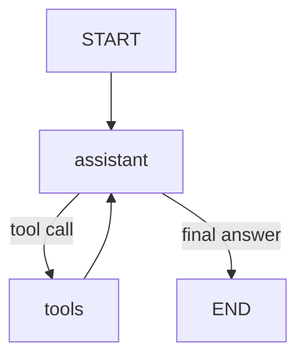

# 📧 دستیار ایمیل

یک ایجنت هوش مصنوعی که صندوق ورودی واقعی شما (جیمیل از طریق IMAP/SMTP) را مدیریت میکند.
ساخته شده با **LangGraph**

## ویژگیها

* **چت با صندوق ورودی**: "ایمیلهای خوانده نشده من را خلاصه کن"
* **دسته بندی خودکار**: هر ایمیل برچسب `urgent` (فوری)، `needs_reply` (نیازمند پاسخ)، `newsletter` (خبرنامه)، `spam` (اسپم) یا `other` (سایر) دریافت میکند
* **جستجوی معنایی (RAG)**: یافتن ایمیلها بر اساس مفهوم، نه فقط کلمات کلیدی
* **حافظه**: گفتگوها را به صورت کوتاه مدت و ترجیحات شما را در فایل `memory.txt` به صورت بلندمدت به خاطر میسپارد

## نحوه کارکرد

گره `assistant` همان مدل زبانی بزرگ (LLM) است. زمانی که نیاز به انجام کاری داشته باشد، یک ابزار را فراخوانی میکند (`list_emails` ، `search_emails` ، `send_email` ، `mark_as_read` ، `delete_email` ، `remember`)، نتیجه را دریافت میکند و تا زمانی که بتواند پاسخ نهایی را بدهد به کار خود ادامه میدهد.
